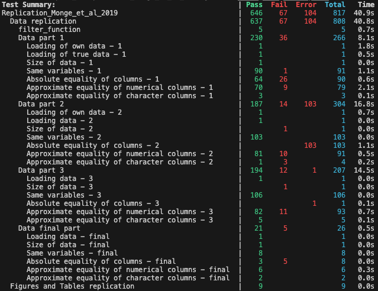

# Replication_Monge_et_al_2019

[](https://Paulogcd.github.io/Replication_Monge_et_al_2019.jl/stable/)
[](https://Paulogcd.github.io/Replication_Monge_et_al_2019.jl/dev/)
[](https://github.com/Paulogcd/Replication_Monge_et_al_2019.jl/actions/workflows/CI.yml?query=branch%3Amain)
[](https://codecov.io/gh/Paulogcd/Replication_Monge_et_al_2019.jl)


This repository is dedicated to our replication project in the scope of [Florian Oswald's](https://www.floswald.github.io) _Computational Economics_ course in 2025 at Sciences Po. We are [Lionel Chambon](https://lionelchambon.github.io), [Etienne Compérat](https://ecomperat.github.io), and [Paulo Gugelmo Cavalheiro Dias](https://www.paulogcd.com). 

We replicated: Monge-Naranjo, Alexander, Juan M. Sánchez, and Raül Santaeulàlia-Llopis. “Natural Resources and Global Misallocation.” American Economic Journal: Macroeconomics 11, no. 2 (2019): 79–126. https://www.jstor.org/stable/26621311.

While the original replication files are coded in Stata, we completed the assignment in Julia.

You can go to its dedicated webpage [here](https://www.paulogcd.com/Replication_Monge_et_al_2019.jl/) to have a better overview of the package. 

# Starting the package :

```
using Pkg
Pkg.activate(".")
Pkg.add(url = "https://github.com/Paulogcd/Replication_Monge_et_al_2019.jl")
using Replication_Monge_et_al_2019 # The precompilation might ake some time (24 seconds on Mac M1)

# to get all the results inside a 'output' folder : 
run()

# to delete all the output : 
delete_all()
```

# Replication results : 

We managed to replicate the whole replication package provided by the authors in Stata.
This file is provided in the `output` folder, under the name `pwt_data_3.csv`. 

We also managed to partially reproduce different figures and tables, namely : 

- Figure 1
- Figure 2
- Figure 3
- Figure 4

- Table 1  
- Table 3
- Table 4
- Table 5

We choose not to include the Figure 2, due to it being a statistic description of data of another paper.

All of the obtained figures and tables are described and discussed in the package website.

# Tests procedure and results 

We used the `Test` package to test the quality of the replicated data, and compare it with the data from the Replication package. 
In this sense, although the tests are failing in the GitHub repository, it does no mean that we did not manage to obtain similar results to the authors. 

Once we are in the folder of the repository, we can run the replication tests.

When running,

```
Pkg.test("Replication_Monge_et_al_2019")
```

We obtain : 


And when running 

```
extensive_tests()
```

We obtain : 



The tests are more detailed in the dedicated section of the website of the package.
