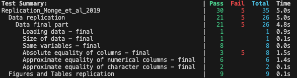

# Replication package of Monge et al 2019

This is the documentation for [Replication\_Monge\_et\_al\_2019](https://github.com/Paulogcd/Replication_Monge_et_al_2019.jl).

This package allows to replicate the results in Monge et al, 2019. 

## Installation 

To install the package, you can enter the pkg mode in Julia by pressing `]`, or you can directly enter : 

```
julia> using Pkg
julia> Pkg.add("https://www.github.com/Paulogcd/Replication_Monge_et_al_2019")
```

To visualise the replicated results, you can first activate the environment, and then use the `run()` function :

```
julia> Pkg.activate(".")
julia> using Replication_Monge_et_al_2019
```

# Two main functions : 

The two main functions of the package are : 

```
# Will produce all the replicated results in an output folder : 

julia> run()

# Will delete all the produced results. 
# The function throws an error if any output file is missing.

julia> delete_all()
```

# Comments on replication results : 

## Data treatment

The main challenge of this project was to reproduce the results of the paper (tables and graphs) without the original code. Indeed, the replication package is only composed of 4 source datasets (pwt80.dta;  timber\_and\_subsoil\_rent\_input.dta; crop\_land\_rent\_input.dta; pasture\_land\_rent\_input.dta), and a do-file (build\_phiNR.do) that merges these datasets into a final one (MSS\_NRshares.dta)  in order to construct the natural resources shares of output. The ReadMe only gives brief information on how to recreate “MSS\_NRshares” from these files, and is quite unhelpful to reproduce anything else. Thus, this project can be decomposed in two parts. First, we recreate the data from the 4 source datasets, basing ourselves on the code provided in “build\_phiNR.do”. Secondly,  we try to reproduce results from the paper without anything to base ourselves on except from the methodology descriptions in the paper and our understanding of the data.

To begin with, the data work consists of three main steps, each of them associated with the merge of a dataset to “pwt80.dta”, and a final step to clean the data, following the structure of the original do-file. First, we merge “pwt80.dta” with “timber\_and\_subsoil\_rent\_input.dta” to compute the share of output associated with timber and subsoil natural resources for all countries, every year from 1970 to 2009. Secondly, we do the same with “crop\_land\_rent\_input.dta” that allows us to compute the share of output associated with crop rents, using different weights. Thirdly, we merge with “pasture\_land\_rent\_input.dta” to do the same for pasture rents. Finally, once everything is merged, we construct from the variables previously generated “phi\_NR”, the natural resources shares of output for each country, each year between 1970 and 2006.

The beginning of “Data\_work.jl” consists of preparing  “pw80.dta” for merging (lines 1-153). After ensuring the data was loaded correctly, we compute the different measures of GDP that we will use to compute our shares of output.

We first merge “pwt80.dta” with “timber\_and\_subsoil\_rent\_input.dta” (lines 154-317) to compute timber and subsoil rents as shares of GDP. Note that simply merging is not sufficient for our computations since we have individual data on GDP for Serbia and Montenegro, but joint data for rents. Thus, we must compute the joint gdp for both countries to compute individual timber and subsoil shares, using individual GDP as weights, for every year.

Then we merge our data with “crop\_land\_rent\_input.dta” (lines 318-851) in order to compute crop land rent share of GDP. However, there are two sets of countries for which we do not have individual data on crop land rents per country over certain periods: Belgium and Luxembourg (from 1966 to 1999); Czech and Slovak Republics (from 1966 to 1992). So, we compute pasture rents for Belgium and Luxembourg separately, splitting rents before 2000 based on the repartition that year. Next, we compute crop rents for Czech and Slovak Republics separately, splitting rents for years before 1993. Finally, we do the same for Serbia and Montenegro, on which the World Bank provides pasture land rents jointly for Serbia and Montenegro  from 1992 to 2005, and then separately for Serbia 2006 to 2011 and Montenegro 2006 to 2011. This allows us to compute “phi\_NR\_crop”.

Next, we merge with “pasture\_land\_rent\_input.dta” (lines 852-1310) to compute pasture land rent share of GDP. Here we encounter the same issues as in the previous part, and deal with it the same way.

Lastly, we clean our data to obtain the equivalent of “MSS\_NRshares.dta” (lines 1312-1563). We start by computing “phi\_NR”, the natural resources share of output each year for every country and the share of each national resources in total output. Then we trim the data, keeping only rows between 1970 and 2006 and the “phi” values for each country. We save our data and obtain a dataset similar to “MSS\_NRshares.dta”.

The main challenge we faced during the data work has obviously to do with the software differences, more specifically regarding the merging and computing methods. In some cases, when computing values for rows with only missing values, the stata command would attribute the value 0 while Julia computed it as missing. We had to be careful with that kind of issues throughout the whole project. Last but not least, it is more than likely that there are slight differences between our final output and the final data provided by the paper because of differences in rounding methods between Julia and Stata. That is why our test result for the final data part, all our values are approximately equal to those in “MSS\_NRshares.dta” but not always absolutely the same.

## Figures and Tables 

This section focuses on the replication of tables and figures from sections II and III.Overall, we were unable to precisely replicate the findings of the paper. We suspectthat this is largely driven by the fact that the replication files provided by the authorsonly detail how to compute the by-country output share of natural resources(MSS/_Nrshares.dta). However, no code or further information is provided on how toobtain the tables and figures presented in the paper, which we attempted to replicatebased on our understanding of their methodology. Hence, if the authors made further assumptions or undertook additional data-cleaning before plotting, this could explainthe discrepancy between our results and theirs.

### Figure 1

We calculate the number of workers as pop*labsh, then we calculate GDP per worker as cdgdpo divided by this number. The result is close to what is shown in the paper. However, we encounter issues when using the fit function to compute the trendline, possibly drive by a lack of variation due to the large values of GDP and the small values of output shares. The authors do not mention any normalization, so we choose to not make any further modifications to the data.

### Figure 2
We calculate GDP quartiles using Julia’s quartile function. However, we cannot replicate the numbers as shown in the paper.

### Figure 3

We can only compute the red elements of this figure as the blue datapoints follow the methodology followed by Casella and Feyrer (2007). While we can calculate the natural resource share using Equation (13), the methodology to compute their estimates of natural resource shares of output is not available in the replication material. Hence, we restrict ourselves to the estimates provided by the authors and finnd similar results.

## Figure 4 and Table 3

QMPK and VMPK are computed following the formulae outlines in sections II and III of the paper. While our estimates are close, we observe minor discrepancies in percentile ranges. Since we cannot verify our computation of MPKs, if the authors undertook further data-cleaning or any additional steps not outlined in the paper, this would explain the divergence in our estimates. They remain, however, reasonably close.

## Tables 4 and 5

It is not possible to reconstruct these tables from the replication files and none of thedatasets provided by the authors include Sachs and Werner’s (1995) opennessindicator. To attempt the replication nonetheless, we used the SW we could find(available here: [https://www.bristol.ac.uk/depts/Economics/Growth/sachs.htm](https://www.bristol.ac.uk/depts/Economics/Growth/sachs.htm)), whichis called `open.csv` in our output folder. We find that the number of obervations doesnot match the ones reported by the authors, so this is likely not the same data theyused. Hence, our results will naturally be different.


# Comments on the Tests

# Tests procedure and results 

We used the `Test` package to test the quality of the replicated data, and compare it with the data from the Replication package. 
In this sense, although the tests are failing in the GitHub repository, it does no mean that we did not manage to obtain similar results to the authors. 

Once we are in the folder of the repository, we can run the replication tests.

When running,

```
Pkg.test("Replication_Monge_et_al_2019")
```

We obtain : 



And when running 

```
extensive_tests()
```

We obtain : 


We implemented a series of test throughout the data work to make sure our final dataset would be faithful to the one used in the paper. The test on “Data final part”  indicates that out of our 8 columns, 3 are absolutely equal to the ones from “MSS\_NRshares.dta” while the 5 others are approximately equal to their counterparts. This slight differences might be due to the different rounding methods used in Stata and Julia. Eventually, we have managed to reproduce faithfully the data used in the paper.We have also led intermediary tests at each step of the data work, where the results are more contrasted. Given our final figures are correct, these differences most likely arise from the merging methods used as well as the functions used for the computations of certain variables. Of course, the rounding method might also play a role here.